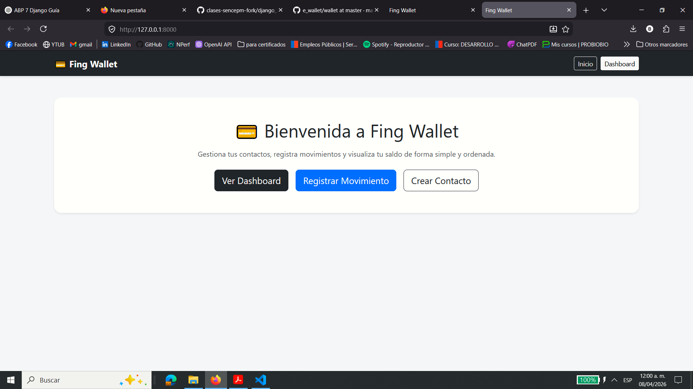
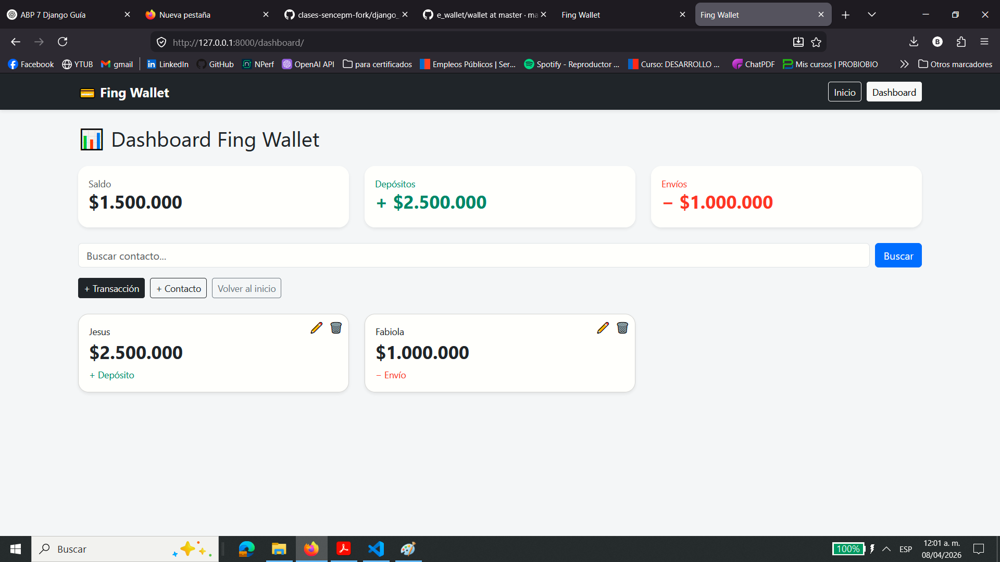
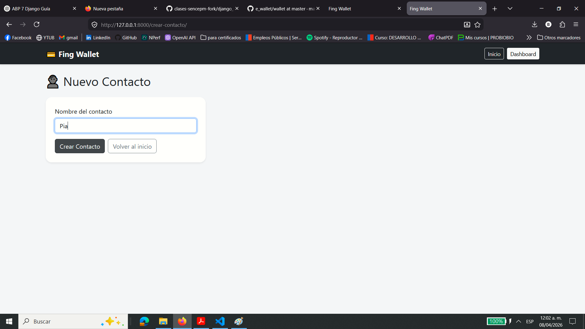
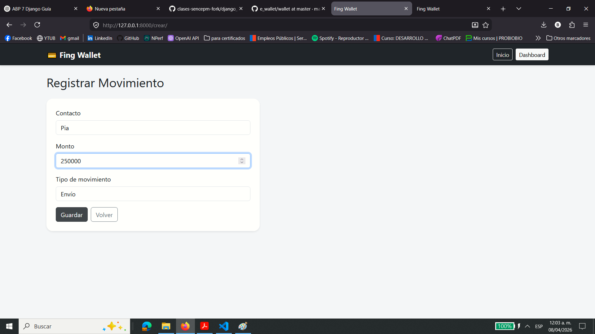
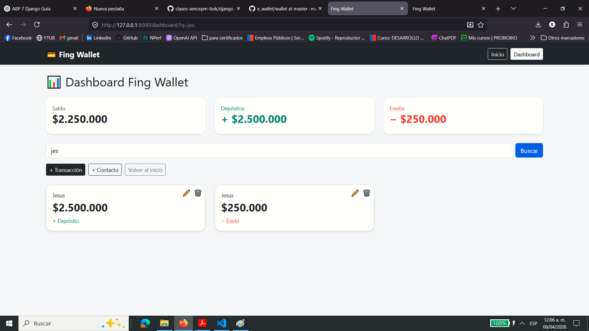
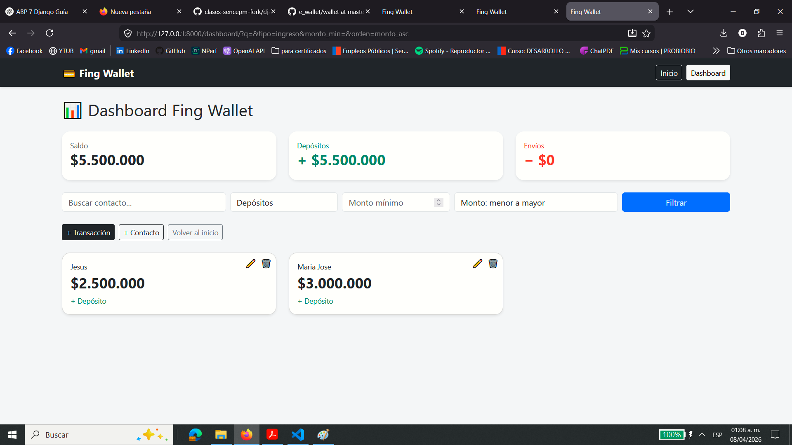

# 💳 Fing Wallet — Billetera Digital con Django

## 📌 Descripción del Proyecto

Fing Wallet es una aplicación web desarrollada con Django que simula el funcionamiento de una billetera digital, permitiendo registrar movimientos de dinero asociados a distintos contactos.

La aplicación permite gestionar depósitos y envíos, visualizar el saldo en tiempo real y mantener un historial organizado de movimientos.

---

## 🎯 Objetivo

El objetivo del proyecto es aplicar los conocimientos del módulo de Acceso a Datos con Django, utilizando:

- Base de datos SQLite
- Modelos relacionales
- Uso del ORM de Django
- Migraciones
- Operaciones CRUD completas
- Templates personalizados
- Filtros dinámicos de información

---

## 🚀 Enfoque del sistema

El sistema fue diseñado como una billetera digital simple de uso personal:

- Existe un único usuario del sistema (quien utiliza la aplicación)
- Los registros se asocian a **contactos**
- Se registran movimientos como **depósitos** y **envíos**
- El saldo se calcula dinámicamente en función de las transacciones

Este enfoque permite simplificar la lógica manteniendo coherencia con el dominio fintech.

---

## 🧩 Modelo de datos

### 👤 Contacto

Representa una persona asociada a movimientos financieros.

**Campos principales:**
- `nombre`

---

### 💸 Transacción

Representa un movimiento de dinero dentro del sistema.

**Campos principales:**
- `contacto` → relación con Contacto
- `monto`
- `tipo` → ingreso / gasto (visualizado como depósito / envío)

---

## 🔗 Relaciones entre modelos

- Un contacto puede tener múltiples transacciones
- Cada transacción pertenece a un único contacto

Esta relación se implementa mediante `ForeignKey`.

---

## 💰 Cálculo del saldo

El saldo no se almacena en la base de datos, sino que se calcula dinámicamente:

- suma de depósitos
- menos suma de envíos

Esto evita inconsistencias y asegura que el saldo siempre refleje el estado real.

---

## 🔄 Operaciones CRUD

### ➕ Crear
- Crear contacto
- Registrar movimiento

### 👁️ Leer
- Dashboard con saldo total
- Listado de transacciones
- Detalle por contacto

### ✏️ Actualizar
- Edición de transacciones

### 🗑️ Eliminar
- Eliminación de transacciones

---

## 🔍 Filtro de búsqueda

Se implementó un sistema de filtros combinables que permite:

- Buscar por nombre de contacto
- Filtrar por tipo de transacción (depósito / envío)
- Filtrar por monto mínimo

Esto se implementa mediante parámetros GET y consultas dinámicas usando el ORM de Django.

También se implementa ordenamiento dinámico por monto (ascendente y descendente) utilizando `.order_by()`.

---

## 🧠 Uso del ORM de Django

Métodos utilizados en el proyecto:

- `.all()`
- `.filter()`
- `.get()`
- `.create()`
- `.save()`
- `.delete()`

---

## 📌 Diferencia entre `.get()` y `.filter()`

### `.get()`
- Retorna un único objeto
- Lanza error si no existe o hay más de uno

### `.filter()`
- Retorna múltiples resultados (QuerySet)
- No lanza error si no hay coincidencias

---

## 🗃️ Migraciones

Las migraciones permiten sincronizar los modelos con la base de datos.

Si no se ejecutan:

- La base de datos no se actualiza
- Se genera inconsistencia con el código
- Pueden ocurrir errores en ejecución

Las migraciones se almacenan en:
tareas/migrations/

---

## 🧱 Arquitectura del proyecto

El proyecto sigue el patrón MTV (Model - Template - View):

- **Model:** estructura de datos
- **View:** lógica de negocio
- **Template:** presentación en el navegador

Se evita incluir lógica de base de datos en los templates.

---

## 🔄 Flujo de una solicitud

1. El usuario accede a una URL
2. Django evalúa `urls.py`
3. Se ejecuta la vista correspondiente
4. La vista interactúa con el ORM
5. Se obtiene o modifica información
6. Se envía un contexto al template
7. El template renderiza la información

---

## 🖥️ Funcionalidades del sistema

- Menú de inicio
- Dashboard con saldo, depósitos y envíos
- Crear contacto
- Registrar movimiento
- Editar transacción
- Eliminar transacción
- Buscar contacto
- Ver detalle por contacto

---

## 🧠 Decisiones de diseño

El sistema fue diseñado priorizando simplicidad y claridad:

- Se utiliza un modelo de contactos en lugar de autenticación de usuarios
- El saldo se calcula dinámicamente, evitando redundancia
- Se utilizan nombres amigables (depósito / envío) en la interfaz

Esto permite cumplir los objetivos del módulo sin complejidad innecesaria.

---

## ⚙️ Limitaciones del sistema

- No existe sistema de login
- No hay validación de saldo insuficiente
- Las transacciones pueden eliminarse directamente
- No existe separación por usuario autenticado

Estas decisiones responden al alcance académico del proyecto.

---

## 🚀 Posibles mejoras

El sistema puede evolucionar incorporando:

- Autenticación con Django Auth
- Modelo Wallet por usuario
- Validación de saldo antes de enviar dinero
- Sistema de reversas en lugar de eliminación
- Filtros por fecha y monto
- Visualización con gráficos
- Mejora de interfaz tipo fintech real

---

## 📈 Escalabilidad

La estructura actual permite escalar el sistema mediante:

- Separación de lógica en capas (`services.py`)
- Uso de bases de datos más robustas (PostgreSQL)
- Implementación de APIs externas
- Incorporación de autenticación y sesiones

Actualmente es un sistema de aprendizaje, pero extensible.

---

## 🧡 Reflexión final

Este proyecto permitió comprender de forma práctica:

- El funcionamiento del ORM de Django
- La relación entre modelos, vistas y templates
- La persistencia de datos en aplicaciones web

Además, implicó resolver errores reales, fortaleciendo la comprensión del framework.

---

## ▶️ Ejecución del proyecto

python manage.py runserver

Abrir en: http://127.0.0.1:8000/

---

## 🛠️ Tecnologías utilizadas

| Tecnología | Descripción |
|-----------|------------|
| 🐍 Python | Lenguaje principal del proyecto |
| 🌐 Django | Framework web utilizado |
| 🗄️ SQLite | Base de datos relacional |
| 🎨 HTML5 | Estructura de las vistas |
| 🎯 Bootstrap 5 | Estilos y diseño responsivo |
| ⚙️ Django ORM | Manejo de base de datos |

## 📝 Respuestas a preguntas de evaluación

## 🧩 Sobre los modelos

¿Qué modelos definiste y por qué elegiste esos?
Se definieron dos modelos principales:

Contacto: representa a una persona asociada a movimientos financieros.
Transacción: representa un movimiento de dinero.

Esta estructura fue elegida porque permite modelar de forma simple una billetera digital, donde una persona usuaria del sistema registra movimientos asociados a distintos contactos.

¿Qué tipo de relación usaste entre tus modelos y por qué?
Se utilizó una relación ForeignKey desde Transaccion hacia Contacto, porque un contacto puede tener muchas transacciones y cada transacción pertenece a un solo contacto.

¿Qué valor le pusiste a on_delete y por qué?
Se utilizó on_delete=models.CASCADE, de modo que si se elimina un contacto, también se eliminan sus transacciones asociadas. Esto evita registros huérfanos.

## ⚙️ Sobre el ORM

¿Qué métodos del ORM usaste para cada operación CRUD?

Create: .create()
Read: .all(), .filter(), .get()
Update: .save()
Delete: .delete()

¿Qué método usaste en la vista de filtro/búsqueda para construir la consulta?
Se utilizó .filter() con parámetros GET para buscar por nombre de contacto, filtrar por tipo de transacción y por monto mínimo.

¿Cuál es la diferencia entre .get() y .filter()?
.get() retorna un solo objeto y lanza error si no existe o hay más de uno.
.filter() retorna un conjunto de resultados y no lanza error si no encuentra coincidencias.

## 🗃️ Sobre las migraciones

¿Qué pasaría si modificas un modelo pero no generas una nueva migración?
La base de datos no se actualizaría, generando una inconsistencia entre el código y la estructura real de las tablas. Eso puede provocar errores en ejecución.

¿Dónde se almacenan los archivos de migración y para qué sirven?
Se almacenan en:

'' tareas/migrations/ ''

Sirven para registrar cambios en los modelos y aplicarlos a la base de datos de forma controlada.

## 🧱 Sobre la arquitectura

¿Por qué es importante que la lógica de base de datos esté en las vistas y no en los templates?
Porque los templates deben encargarse solo de la presentación. La lógica de negocio y acceso a datos debe estar en las vistas para mantener una separación clara de responsabilidades.

¿Cuál es el flujo completo de una solicitud en Django?

La persona usuaria accede a una URL
Django revisa urls.py
Se ejecuta la vista correspondiente
La vista interactúa con el ORM
Se obtiene o modifica información en la base de datos
Se envía un contexto al template
El template renderiza la información
El navegador muestra el resultado
📸 Evidencia sugerida
Servidor en ejecución
Menú de inicio
Dashboard
Creación de contacto
Registro de movimiento
Edición de transacción
Búsqueda de contacto
Detalle por contacto

## 📸 Capturas

### 🏠 Inicio

---

### 📊 Dashboard

---

### 👤 Crear contacto

---

### 💸 Registrar movimiento

---

### 🔍 Filtros aplicados (nombre y tipo transacción)

---

## 👩‍💻 Autor

**Belén Zambrano**

Desarrolladora Web Trainee 🚀

*Proyecto desarrollado como parte del bootcamp Full Stack Python.*